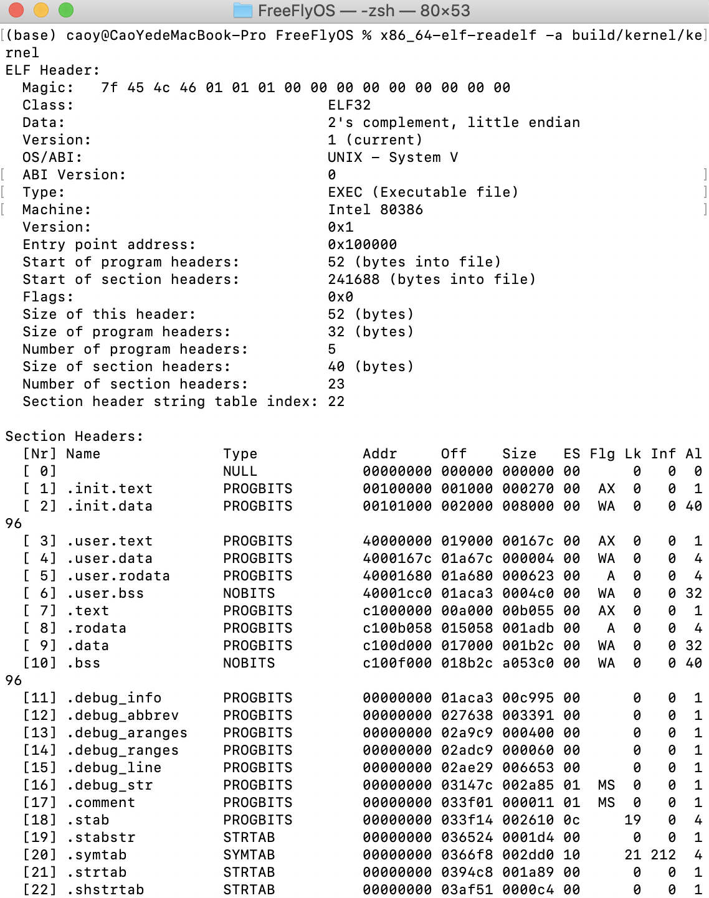

## boot.ld

生成bootblock的链接格式，起始地址从0x7c00开始

## bootsector.S

关中断、内存探测、80x86 CPU从实模式变成保护模式。

## bootmain.c

将elf格式的内核代码读入到指定内存区域中。

## sign.c

将某文件格式化为合法MBR文件，末尾以0xaa55结束。

## CMakeLists.txt

1、编译bootsector.S以及bootmain.c文件生成bootsector.o和bootmain.o

2、将boosector.o和bootmain.o链接到0x7c00地址处生成bootblock.o

3、使用objcopy将bootblack.o复制生成可执行文件bootblock.out

4、使用格式化工具sign将bootblack.out格式化成MBR

5、之后为了给主分区表预留空间，该MBR从0x1BE-0x1FD的空间为主分区表信息，本项目的MBR如下图所示。

## 功能说明

作为一个内核的bootloader，它的主要功能如下：

1、在16位代码段下，应先设置段寄存器（DS、ES、SS）的值（CS默认上电赋值）。

2、关中断，为之后建立中断向量表打好基础。

3、内存探测，通过BIOS提供的0x15中断获取可用内存数据，并存储在内存物理地址0x8000处。

4、打开地址A20，按理说这步应该是要做的，但由于本人环境编译器版本问题，加上这段代码会使MBR超过512B，故只能删掉这部分代码，经过测试，在qemu模拟器不影响后续代码的执行，以此来减少MBR的空间，并为主分区表预留空间。

5、加载gdt表，其中设置了CS和DS段基址为0，段限长为4GB，这样就能访问0-4GB的物理地址了，而实际分配给虚拟机2GB内存，为后面地址映射作准备。

6、接着就是打开保护模式了，把cr0的第0位置1即可，此时就无法调用BIOS中断了，所以如果需要用BIOS中断获取硬件信息，最好在保护模式前就写好。

7、使用ljmp长跳转到保护模式下的32位代码段，该段的属性已经在gdt表中写好，只需确定跳转代码的偏移地址即可。

8、上一步操作已经确定了CS段，而数据段并未确定，所以需要设置DS、ES、SS段的值，这里还设置了gs段的值，之前主要是为了能够用VGA输出字符，但后续直接写了VGA的驱动，所以这里的GS段设置和之前GDT中的VGA段均可删掉。

9、设置下栈地址，栈顶指针指向0x7c00，也就是bootloader开始的位置，但栈是向下增长的，故不会影响bootloader代码，在bootmain.c中会调用函数，故需要一个栈来存放参数和返回地址等信息。

10、将内核加载到内存中，一般内核文件都是elf文件格式，为了能够读取内核的elf头，我们将内核文件放在引导扇区MBR后面一个扇区，通过x86_64-elf-readelf -a build/kernel/kernel可以看到内核的elf文件布局，如下图所示。

从这张图中我们能看到整个内核文件基本分为3个部分：init部分（.init.text/data）、user部分（.user.text/data/rodata/bss）、kernel部分(.text/rodata/data/bss)，各个部分的段地址由链接脚本决定，由于这个时候我们还没开启分页，虚拟地址=物理地址，而且实际物理内存只有2G，所以内核部分（即从C1000000开始）的代码，故在bootmain中需要进行一个判断，若虚拟地址大于2G，即内核代码，放在0x1000000处，当然，也可以设置qemu模拟器的内存大小，比如分配4G，但要注意的一点是，当分配给qemu模拟器4G内存中，可用只有3.5G，此后到4G之间的物理地址无法使用。

然后就是通过IO端口和硬盘进行交互，将各个部分的各个段读到对应的虚拟地址上（虚拟地址=物理地址），最后跳转到ELF文件的entry中，即0x100000（init部分的代码）。

12、boot下的链接脚本，如下图所示，0x7C00为约定好的系统引导地址，即BIOS执行完后，会自动执行0x7C00开始的bootloader。

13、关于CMakeLists.txt的一些解释

1⃣️project ( )------首先设置项目名称，一般这个可以随意设置，然后要注明使用了哪些语言，比如C语言，ASM汇编，若不指定则在编译时会自动看成C语言，.S文件就编译不了，需要在上层目录下的CMakeLists.txt下使能编译器。

2⃣️add_library------将源文件编译成静态库文件，可以把它看成x86_64-elf-gcc(MAC下)/gcc(Ubuntu下) -c bootsector.c -o bootsector.o，当然这个编译选项在上一层也就是整个项目目录下的CMakeLists.txt确定的，如下图所示。

具体说明下每个参数是啥意思吧：

-Os：主要对程序的尺寸进行优化，为了减少MBR的大小，可谓绞尽脑汁。

-nostdlib：不连接系统标准启动文件和标准哭文件，只把指定的文件传递给连接库，这样我们就能重写printf等，不会和标准C库重名了。

-fno-builtin：不使用C语言的内建函数，所以我们设置的函数名可以和内建函数同名。

-Wall：显示所有警告。

-ggdb：产生debug信息，用于gdb调试

-m32：生成32位机器的汇编代码

-gstabs：以stabs格式声称调试信息，但是不包括gdb调试信息。

-nostdinc：不包含C语言的标准库的头文件。

-fno-stack-protector：不使用栈保护检测。

3⃣️add_executable------将静态库文件链接成可执行文件，实际使用时为x86_64-elf-ld命令（MAC下）/ld命令（Ubuntu下）

4⃣️target_link_options-----设置链接选项，-T指定链接脚本，-Wl 传递参数 ，-melf_i386链接为32位程序

5⃣️add_custom_command-----在生成项目文件后，继续执行指定的命令，比如把.o文件转化为二进制文件，然后通过格式化文件sign将bootloader格式化为MBR。

最后，boot目录大概就总结这么多吧，有不懂的地方随时联系我，295957410@qq.com。

