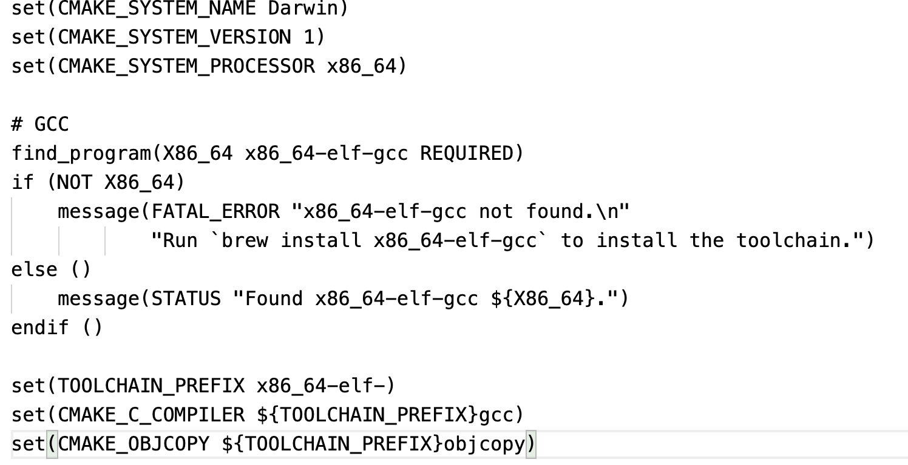
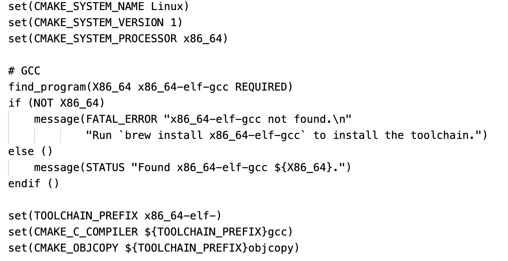

#### mac_x86_toolchain.cmake

通过.cmake设置不同环境下的编译工具链，mac环境下的工具链如下图所示。

另外说明一下，本人用的是64位的x86机器，如果使用的是32位的机器，那就需要根据情况来设定，看到这里，有很多读者可能会问，MAC电脑下自带gcc版本，为什么要用x86_64-elf-gcc呢，因为MAC电脑下的gcc只支持MAC系统下的文件系统，不认elf文件系统，那我们要写一个类似Linux的内核，肯定要用到它的文件系统，而gcc早就帮我们想到了这一点，所以其提供了跨平台的编译器----x86_64-elf-gcc，这样我们编译链接运行出来的就是elf文件格式了。

#### linux_x86_toolchain.cmake

linux环境下的工具链如下图

看到这里是不是很奇怪，怎么和MAC环境下的配置一模一样吗，按理说，linux环境下的gcc支持elf文件格式，没必要使用跨平台的x86_64-elf-gcc啊，呃，这实际上和MBR有关，FreeFlyOS的MBR中的内容太多了，又要开保护模式，又要设置gdt，还得读取内核，还用到了函数，这就会导致最后生成的二进制文件超过512B。其实这也不是主要原因，我发现了linux下的gcc编译链接出来的文件都会加上一些其他的section，讲道理，要运行FreeFlyOS的MBR包括.text和.data段就足够了，所以其他section就没用了，还会增加文件大小。而用跨平台的x86_64-elf-gcc就不会有这个问题了，当然，我也试过把其他section剥离，最后还是会超过512B，无奈只能选择x86_64-elf-gcc了。对编译链接以及elf文件感兴趣的同学可以看看下面的链接，教你打造史上最小的可执行ELF文件（45字节）。

https://www.bookstack.cn/read/open-c-book/zh-chapters-02-chapter8.markdown#%E6%89%93%E9%80%A0%E5%8F%B2%E4%B8%8A%E6%9C%80%E5%B0%8F%E5%8F%AF%E6%89%A7%E8%A1%8C%20ELF%20%E6%96%87%E4%BB%B6%EF%BC%8845%20%E5%AD%97%E8%8A%82%EF%BC%8C%E5%8F%AF%E6%89%93%E5%8D%B0%E5%AD%97%E7%AC%A6%E4%B8%B2%EF%BC%89

