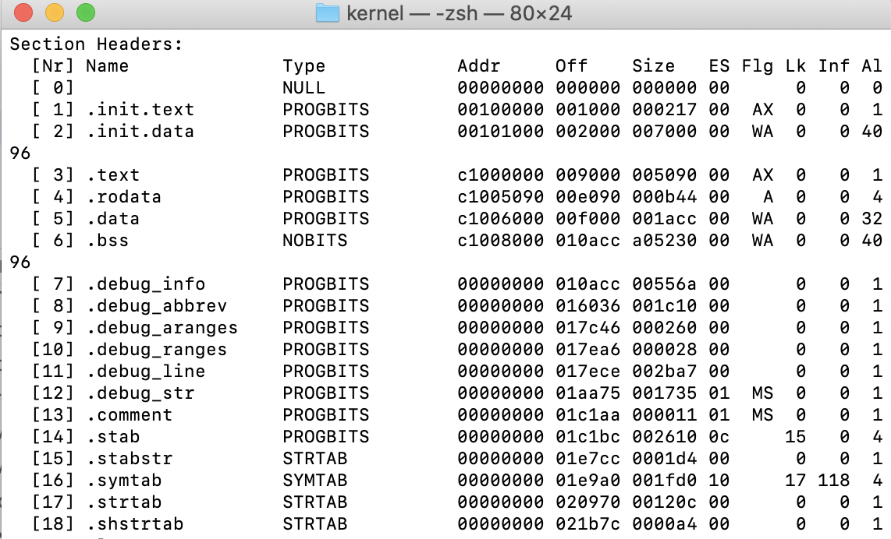
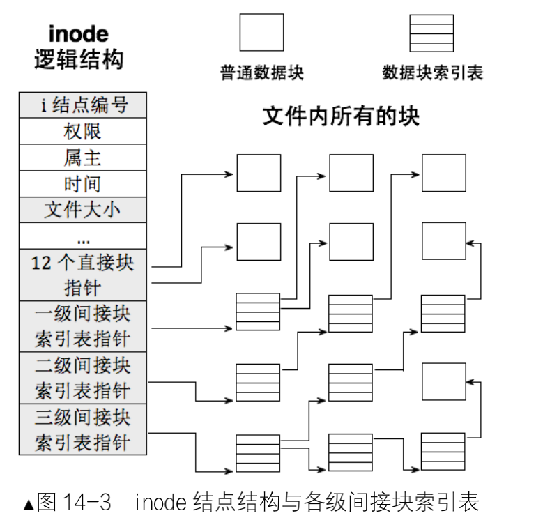
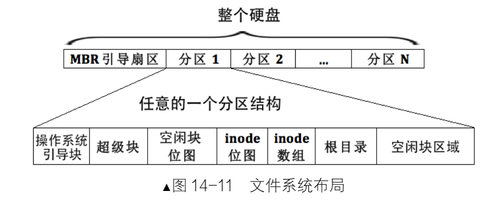
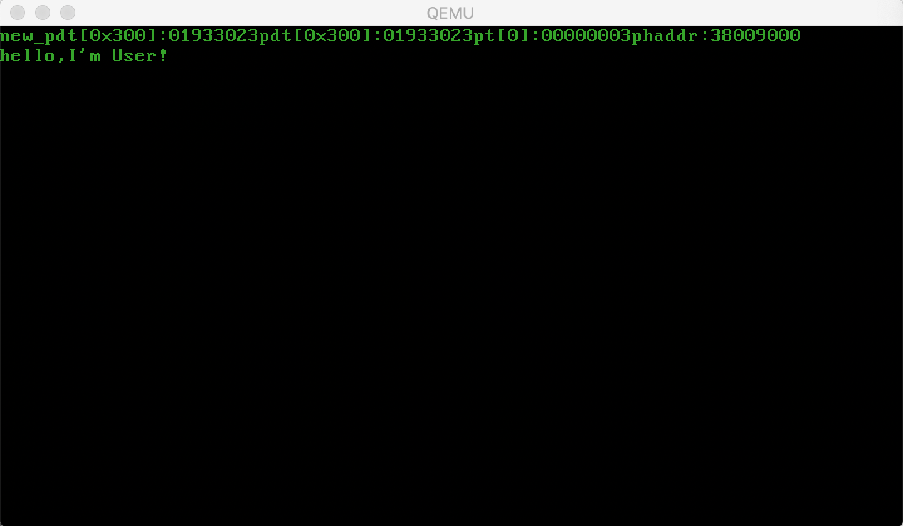

####  2020.11.29

搞了两天bochs没弄出来，就这样吧，等以后再看看别人怎么踩坑的。

开始在qemu下搞文件系统了。。

目前计划：先从简单的扇区读写操作开始，然后一步步地向上层走，那么今天先实现下扇区读写吧！

由于之前在写boot的时候已经有扇区读写的操作，那么首先进行复用吧，现在缺少的是写扇区操作，看下其他OS是怎么实现的。

#### 2020.11.30

现在基本的扇区读写已经完成了，后续继续进行文件系统的编写。

感觉之前的task全局变量未初始化是symtab没对应的关系？

想多了，应该还是更换页表啥，刷内存了？

#### 2020.12.2

#### 2020.12.3

测试之前的代码！

文件系统，冲！

#### 2020.12.8

主要问题，初始化分区时会覆盖0x815扇区的东西，所以主分区只需要初始化一次，后面就无需再改了。文件系统目前基本搞定了，

考虑下一步做啥？年底前把该项目完结吧！

目前需要的模块：

shell交互

进程的fork

exec加载用户进程

进程通信

#### 2020.12.9

设置user属性

