## 进程管理

#### 2020.10.28

在简陋的内存管理完成后，开始令人头疼的进程管理，最近老师push的厉害，预计开发周期1个月，敲代码使我头秃，头秃使我变强，敲代码=变强，就一个字，冲！

----

今日目标：初始化第一个进程，并打印时间信息。

进程管理知识结构：

Step 1:初识进程相关寄存器

在看完上面三张图后，是不是一脸懵逼？没关系，我看完之后也是一样的，接下来咱们就慢慢理解了。

作为X86的CPU，每一个进程对应一个TSS，这个TSS描述符是放在GDT表中的，然后TR寄存器指向这个TSS的段选择子，就完成了一个任务的初始化。

所以，可将今日目标分为几个小目标：TSS结构体初始化、TSS描述符初始化、TR寄存器指向TSS描述符、打印时间。

##### TSS结构体初始化

既然是写第一个进程，那么我们希望它是处在内核态的，因为我们目前没有可以给用户态使用的代码，这样写打印时间比较简单!

总感觉这个tss的初始化有点问题，先不管了。

##### TSS描述符初始化

从上图的GDT大致就知道了TSS描述符如何初始化，和普通的段描述符还是有点不同。

##### 将选择子加载到TR寄存器

写完感觉还是有点不对劲？将段选择子加载到TR又会发生什么呢。。

#### 2020.10.29

难受，昨天目标没达成，晚上健身的时候被老同学叫去喝酒，一晚上没怎么睡，所以得出一个结论，喝酒使人精力旺盛，早上一杯酒，干到99，加油，打工王！

今日目标：完成昨日目标，然后做老板安排的任务，不能再摸鱼了，要被骂的。。。。。。。。

回顾下昨天的进度，在Linux0.11内核里面，LDT貌似是个比较重要的结构，但是LDT在现代处理器中没有太大作用。

在例如 80286 等没有分页功能的处理器上，LDT 提供了多个进程实现独立地址空间的功能，每个用户进程分配一个单独的 LDT 来描述私有内存，实现每个进程单独的内存特权级等属性的定义，同时，GDT 描述共享内存和内核内存

由于 GDT 描述的内存对于所有进程来说都是可见的，且具有相同权限，如果需要为每个进程单独定义权限，也可以通过定义 LDT 的方式来解决，具体做法是创建 LDT 描述符，定义独立的属性，但内存指向 GDT 描述符所描述的相同内存

但是，通过 LDT 来解决进程间内存独立的问题，其代价是寄存器的反复加载，这对于 CPU 来说是一件较为耗时的操作，于是，80386 开始，Intel 引入了内存分页功能，相比于 LDT，更为灵活高效，因此 LDT 已经基本不会被使用了。

这样理解下来，感觉昨天任务基本完成？

这两行代码执行完毕后，进程就应该已经在跑了，开始紧张刺激的编译调试环节。

跑还是能跑的，现在的问题就是怎么查看任务的运行状态。

#### 2020.10.31

今日目标：线程切换，循环打印

纠正：之前对进程的理解有误，因为进程会在用户态和内核态之间来回切换运行，而目前的进程一直处于内核态，所以应该是内核线程。

相关知识点：大概就两个点，根据老线程创建一个新线程，时钟调度。

#### 2020.11.1

遇到的BUG：Switch_to无限循环。

解决：当调用print时候，无法获取task0和task1的context信息，所以每次初始化一下即可，进行简单示意，后续需改进。

#### 2020.11.6

分配进程资源，进程链表，进程哈希表（避免声明数组造成空间浪费）

1、分配PID

2、进程链表管理

3、PID哈希表管理

4、分配task_struct

5、设置task0属性

6、设置中断帧(用于中断)和进程上下文(用于切换进程)。

TSS一般只需设置内核栈地址，其余无需自己设置？

用gdb调一下：

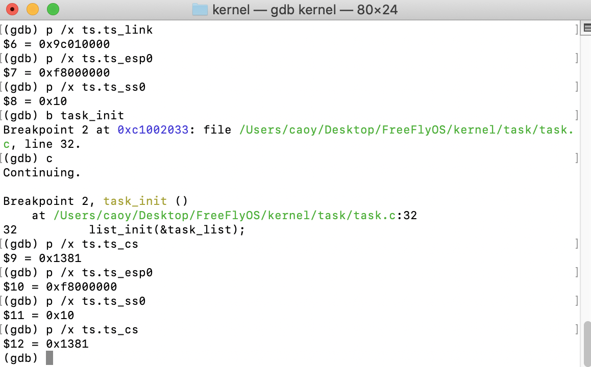

调了一下，发现TSS作用不大，只有一个内核栈有用？其他参数基本可以忽略。因为目前只有内核进程，所以不需要TSS进行特权级转换。

#### 2020.11.8

发现一个有趣的BUG，已经初始化的静态全局变量也会取随机值？

感觉和编译器优化有关，本系统用了-Os，话不多说，测试一下就知道了：

在UBUNTU20 中可以完美运行:

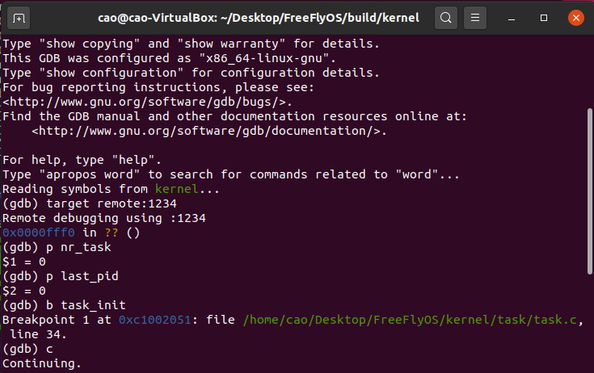

在MACOS下，static变量会进行初始化，但运行的时候会跑偏？

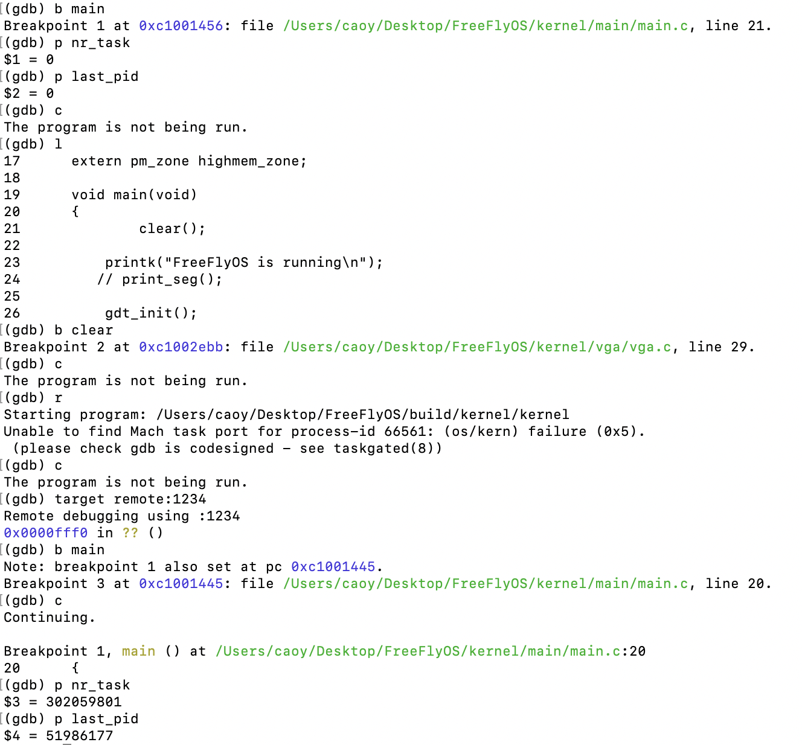

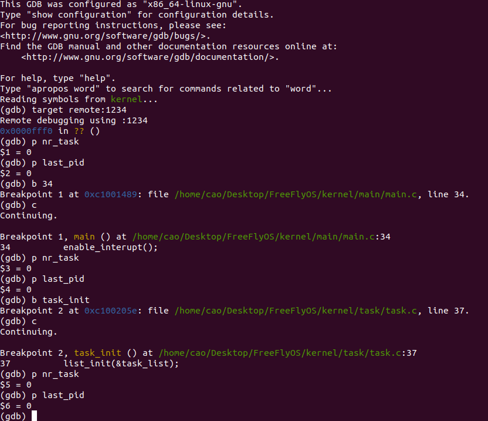

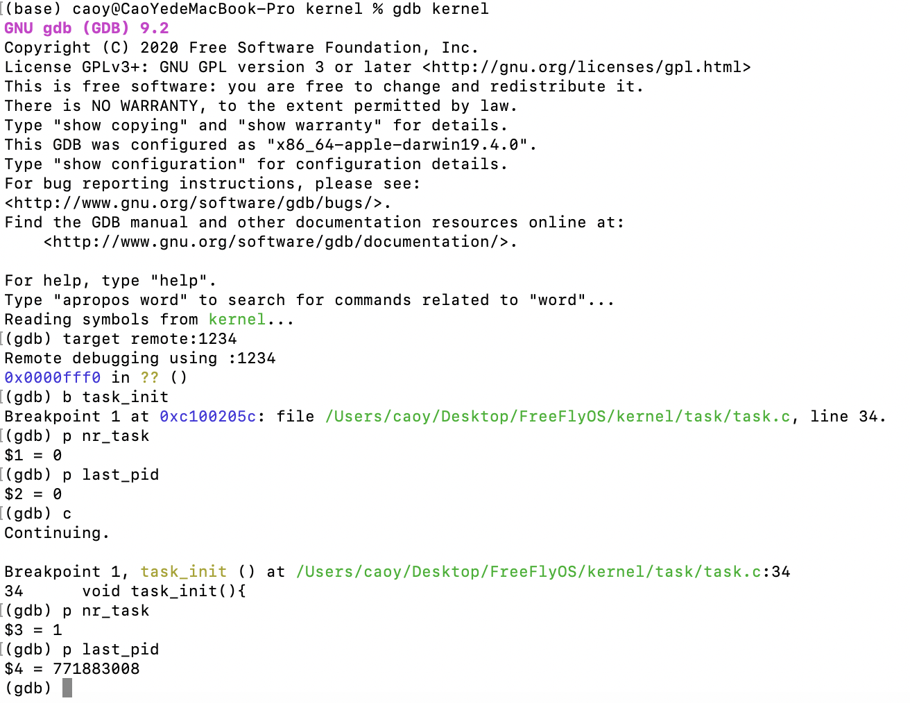

有意思的一点是当初始化为非0值时就不会跑飞。

感觉这是和体系结构相关的知识，不同OS的编译器可能略有不同？ 不管怎么说，以后在使用静态变量时，如果为0那么应该在函数中初始化，如果为非0值可以在定义的时候初始化。说来说去，感觉还是编译器的问题。。。

#### 2020.11.9

完善VMA分配

#### 2020.11.10

进程调度：

新进程的ESP设置有问题，中断帧和环境上下文esp

明天再看下栈的问题

#### 2020.11.12

今天看到一个有意思的代码

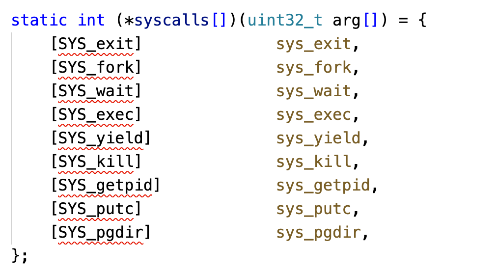

函数指针数组，我是这么理解的

首先看一下这个奇葩的数组定义（可成功运行）。

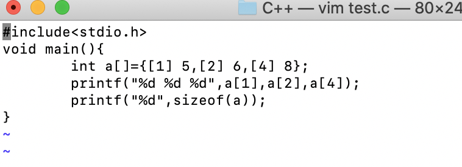

然后*syscalls[]（uint32_t arg[]）代表函数指针数组，每个数组元素都是一个函数指针，指向一个函数，比如

syscalls[SYS_exit]（uint32_t arg[]）=sys_exit（uint32_t arg[]）

#### 2020.11.13

加载elf程序，有点像之前搞的项目。。。

但这中间没有硬盘的操作，而是由编译器完成了内存加载过程，所以可以把用户程序看作一个已经加载到规定线性地址的ELF程序，剩下的就是解析映射了。

#### 2020.11.14

今天争取把用户进程加载elf文件搞完。冲

- -nostdinc：生成OS时不应包含C语言标准库函数，需要自己实现，因此对于C文件里包含的头文件应给出头文件所在目录，如-Ikern/init/、-Ikern/driver/，已-I开头+文件夹表示寻找头文件的路径

- -march=i686：编译生成的目标文件指令集架构为i686，即Intel 32位指令集

- -m32：生成32位目标文件

- -fno-builtin：只识别以`__builtin_`作为前缀的内置函数，并可对其进行优化，也即防止内核代码函数名与内置函数名冲突而被优化的问题

- -fno-PIC：PIC（position independent code），使用绝对位置，而不是相对位置

- -Wall：显示所有编译警告

- -ggdb：尽可能的生成 gdb 的可以使用的调试信息

- -gstabs：以 stabs 格式声称调试信息，但是不包括 gdb 调试信息

- -fno-stack-protector：禁用堆栈保护器

  目前的例子是把用户程序hello和内核程序kernel放在一起，组成一个elf程序，然后加载到内存中，而实际上hello的线性地址从0x80000开始，所以需要知道hello程序在内核程序中的实际物理地址，即链接在kernel后的hello程序地址，ucore主要思路是在ld过程中读取符号表的地址，

  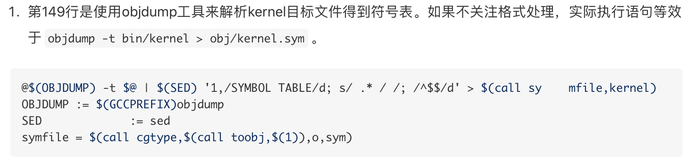

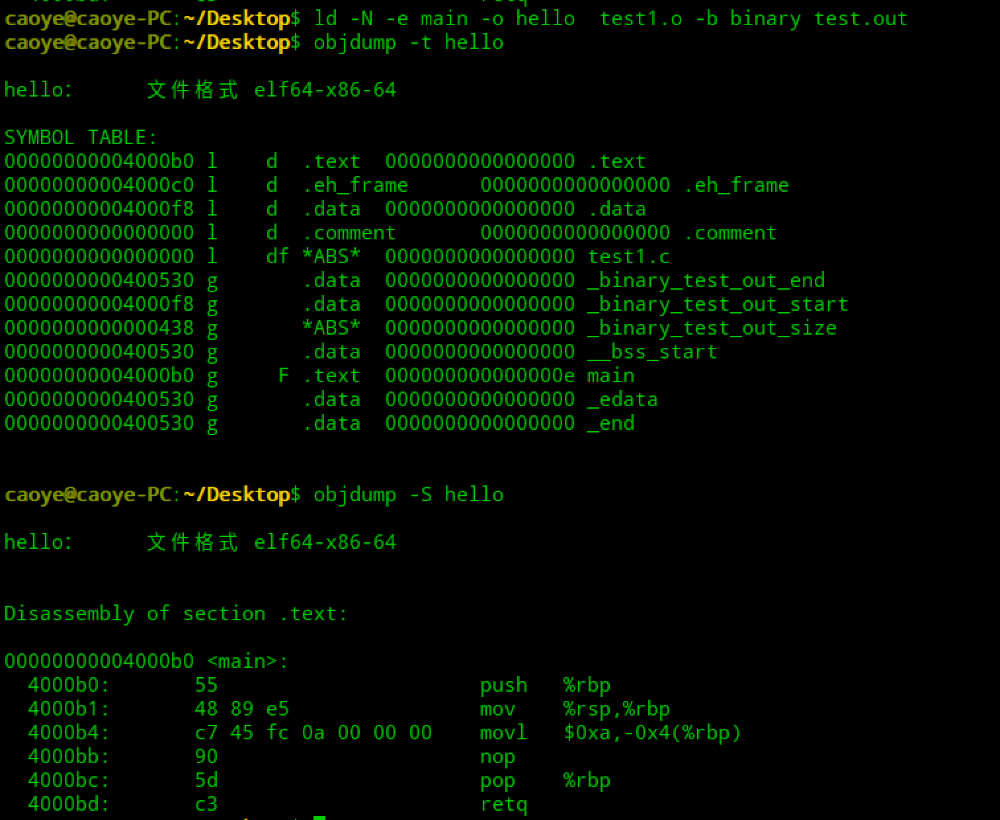

真相大白了，链接时候加-b binary，就会自动生成 _binary_test_out_end 、

_binary_test_out_start和_binary_test_out_size

#### 2020.11.15

target_link_options不支持-b binary

应该是支持的，链接器选项要先加-Wl

放弃了，CMAKE太复杂。

#### 2020.11.16

一个有趣的类型修饰符volatile，用在嵌入汇编asm后，表示这段代码不会被编译器优化。

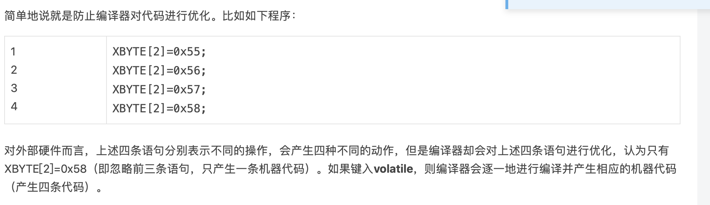

预定义宏

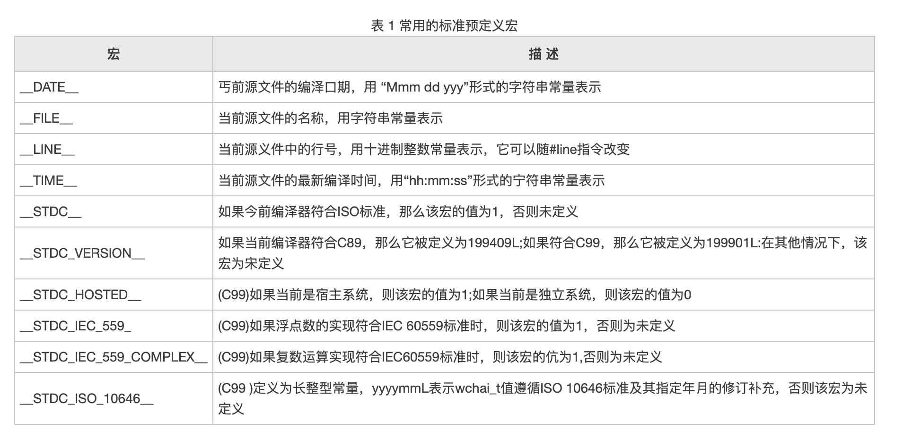

碰到一个BUG

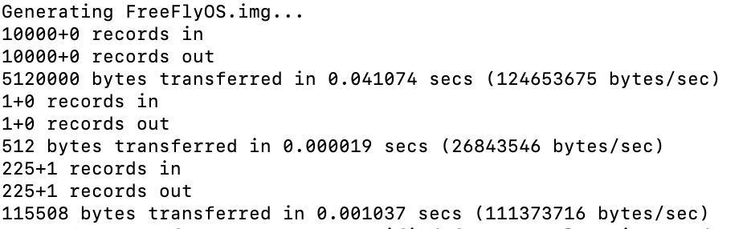

整个IMG就115508字节，最多也就100多K

那么为什么其他文件中未初始化的全局变量放在c1a00000后，main函数中定义的未初始化全局变量放在区域

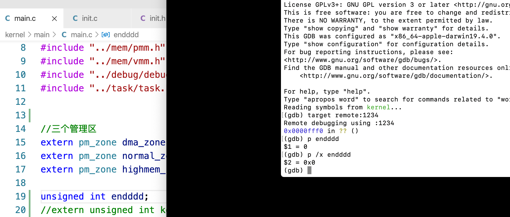

目前猜测IMG文件中的大小是纯粹的文件大小，包含所有段的线性地址空间(text、data、rodata、bss等)，而其他文件中未初始化的全局变量在BSS段

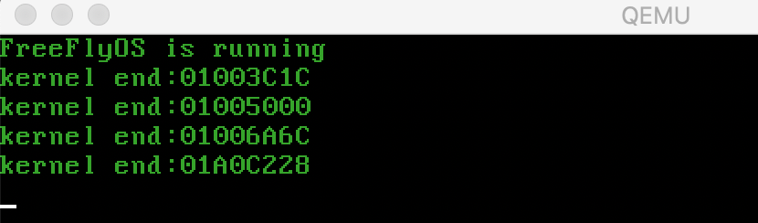

真相出来了，BSS段很大，而且不占用磁盘空间。。。。

#### 2020.11.18

设置临界区

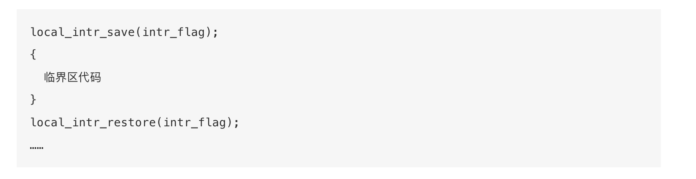

首先理解下花括号的作用，在临界区代码中无法更改intr_flag值，因为其作用域只有括号范围内。

继续看下之前一个BUG，就是静态全局变量初始化不为0?????????

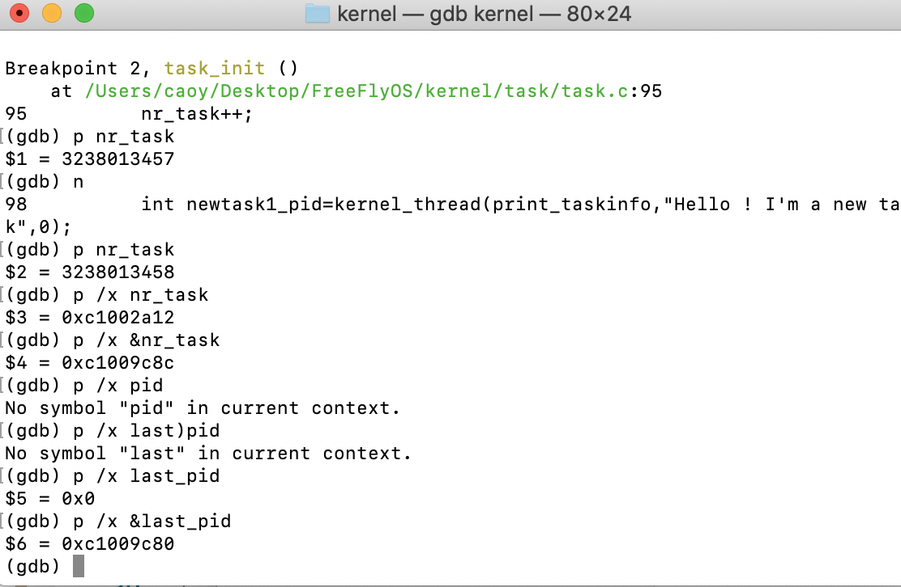

静态局部变量地址不一样。。。这咋回事，难道是GCC版本问题，懒得查了，应该是之前的代码会改内存，比如重新映射页表啥的，就这样吧，反正之前的变量记得重新赋值就行，不影响使用，回去看电视了。

#### 2020.11.24

内核进程怎么变成用户进程？模拟中断返回，

准备工作：

1、建立用户级页表，此前一直使用内核页表，U/S位为0，所以需要弄个用户页表，并将所有页表项的U/S位设置为1

关键问题：

用户进程和内核进程不一样的点在于CS、DS等段寄存器变了，内核CS和内核DS—DPL、RPL、CPL均为KERNEL级别，一般CPL=DPL

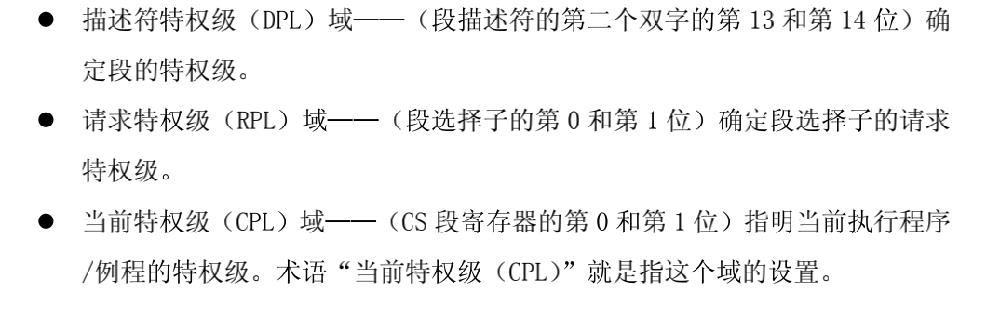

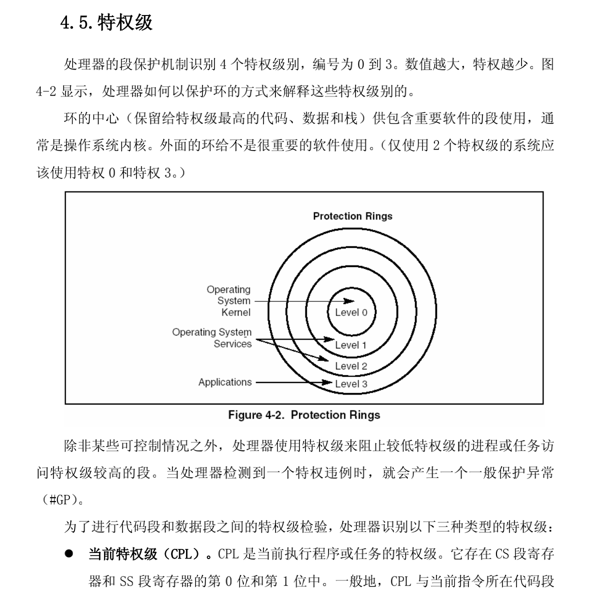

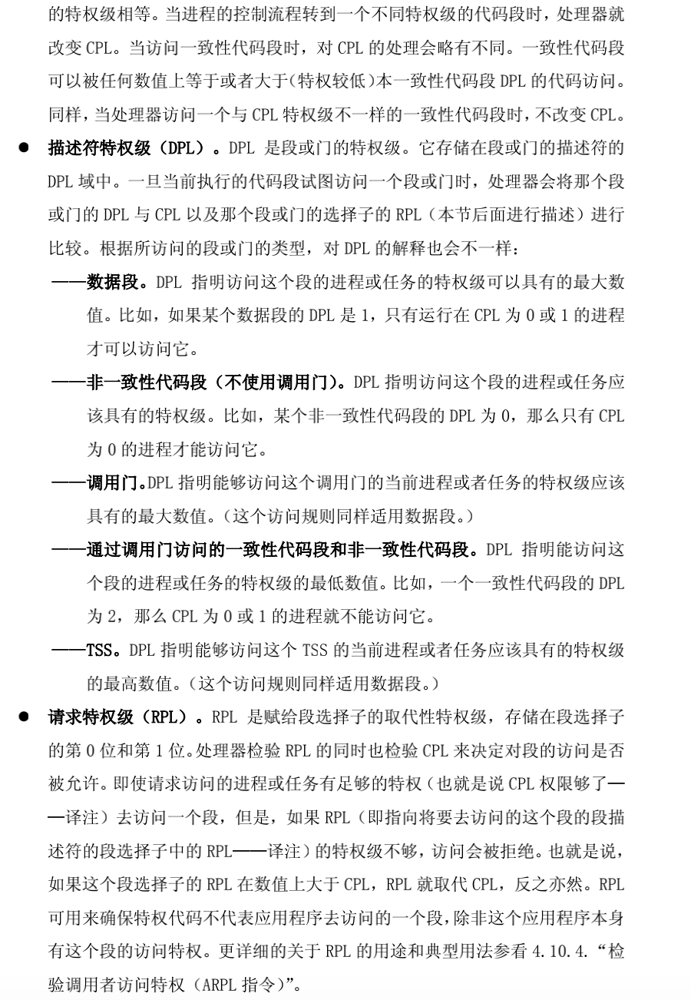

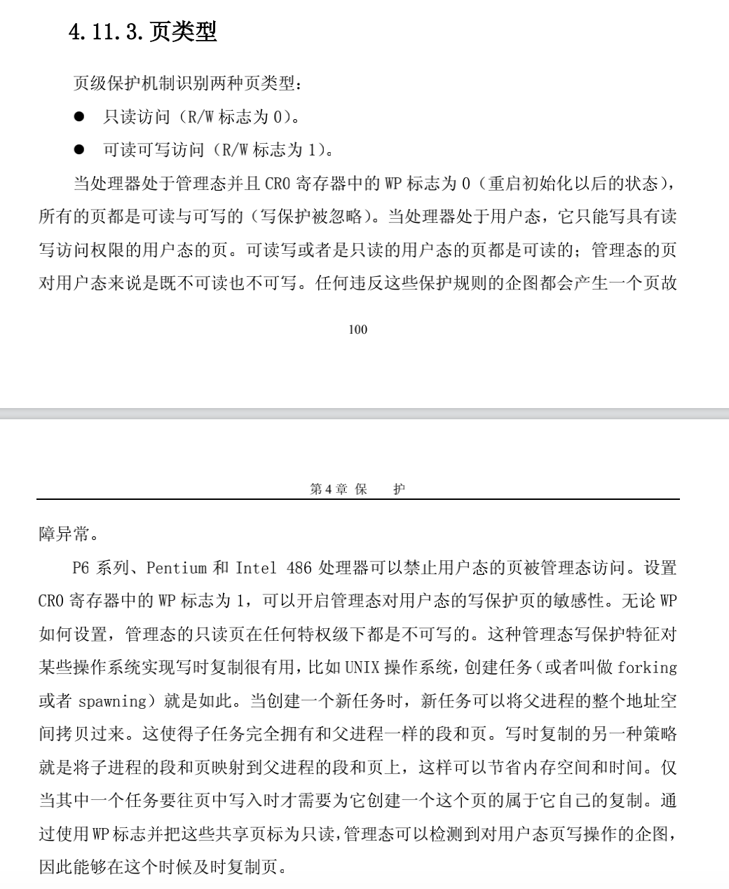

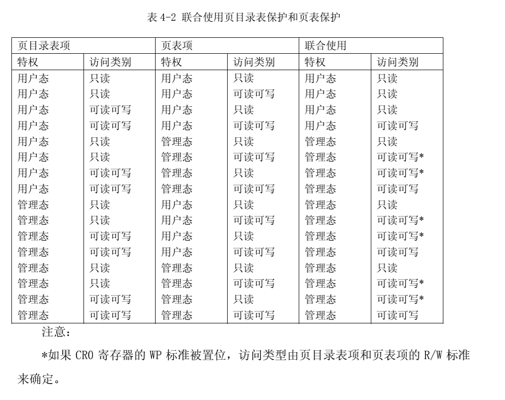

按理来说用户访问