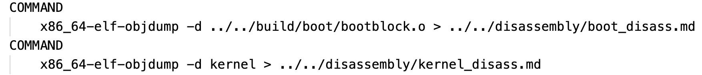
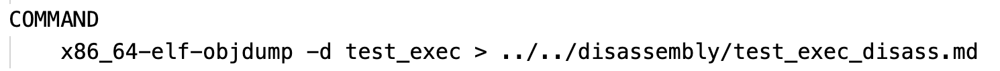
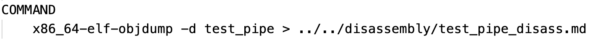

#### 该目录主要是可执行文件的反汇编

只能看到.text段的数据，简单示意下。

boot_disass.md  =====》》》》bootblock(引导程序)的反汇编

kernel_disass.md   =====》》》》kernel(内核)的反汇编代码

test_cat.md =====》》》》test_cat(cat测试程序)的反汇编代码

test_exec_disass.md =====》》》》test_exec(exec测试程序)的反汇编代码

test_pipe_disass.md =====》》》》test_pipe(pipe测试程序)的反汇编代码

通过以下命令可获得:

