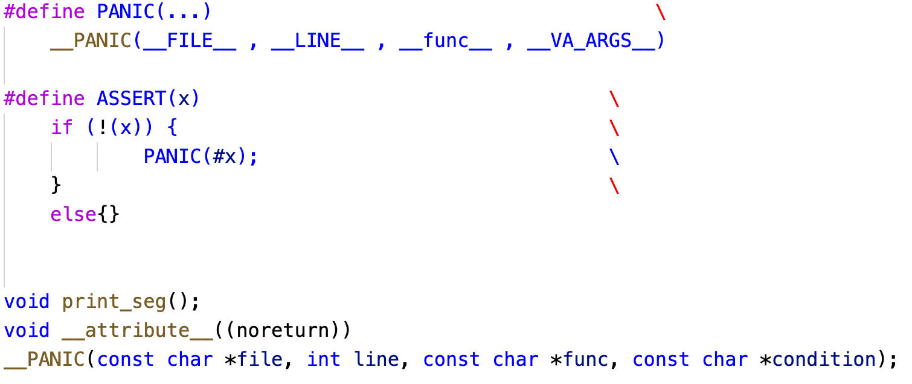

#### debug.c

包含两个函数，一个是打印寄存器信息，另一个是设置断言失败的结果

#### debug.h

设置断言

什么是断言呢，简单来讲就是当程序执行到某一步时，它的状态一定是我预料的状态，也就是我设置的条件必须为真，如果不为真，那么内核就会退出（PANIC），然后运行PANIC函数。这里简单说明下PANIC的几个参数，__FILE__、__LINE__和__func__为C语言中预定义的宏，分别代表当前文件名、当前函数名、运行当前文件的行数，而__VA_ARGS__则是预处理器专门提供的一个标识符，只允许在具有可变参数的宏替换列表中出现，表示该参数至少有一个，但可以为空。我们这里设置的PANIC函数除了前3个宏，只有一个参数，就是断言的判断条件。

#### monitor.c

该文件主要定义了一个类似shell的对话机制，首先需要初始化指令数组，然后分配一个监视器不断读取用户输入的字符，然后使用解析器将用户的字符和预设的指令名称进行匹配，若匹配成功则运行相应指令。

#### monitor.h

monitor.c对应的头文件，其中设置了一个函数指针，用于处理不同指令。

#### readline.c

主要是对输入的字符进行处理，当输入普通字符时，将其记录在buf中，输入退格键，则buf数组清一位，当输入回车键或者换行符，表示指令输入完成，输出buf。

#### readline.h

readline.c对应的头文件，相对比较简单，没啥可讲的。

讲真的，断言其实没必要实现，但实现之后对我们调试有很大的帮助，因为当你无法判断某个函数会不会受某些事件（比如进程切换）影响时，就可以加上一个断言，确认其他事件的状态，保证函数能够正常运行，或者函数出错，再去对断言条件进行分析。呃，由于FreeFlyOS调试好了，基本不会出现断言错误，即monitor不会运行。之前是做这个是因为还没实现shell机制，所以想着先搞个对话机制，支持3种命令。hello、help和game，嘻嘻，一个简单的猜数字游戏，无聊时做的。。。

