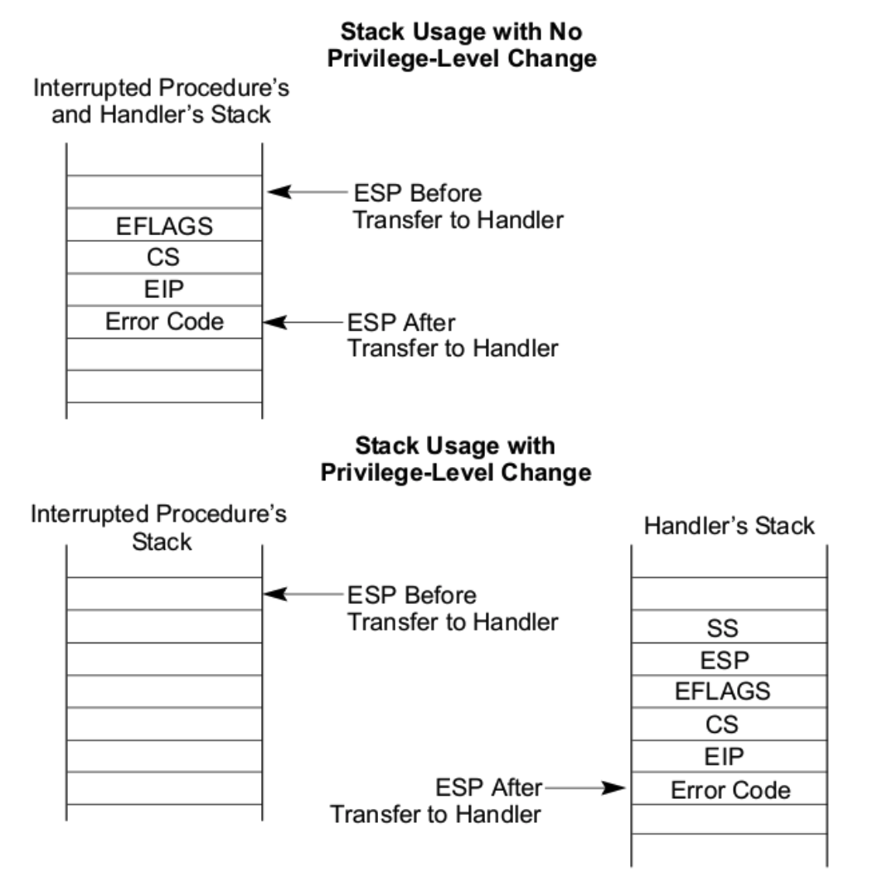
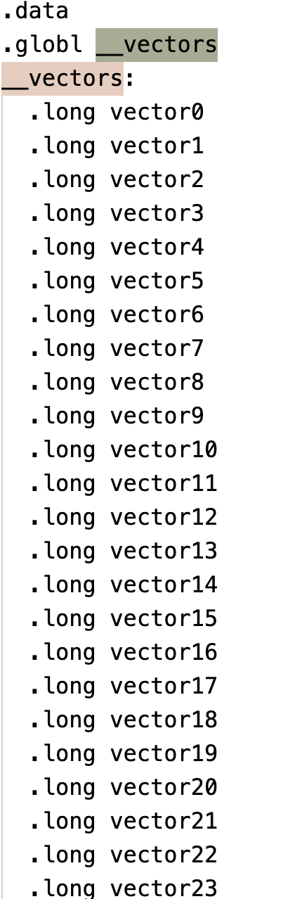
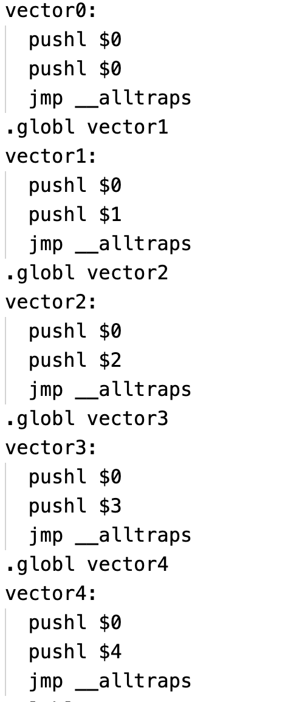
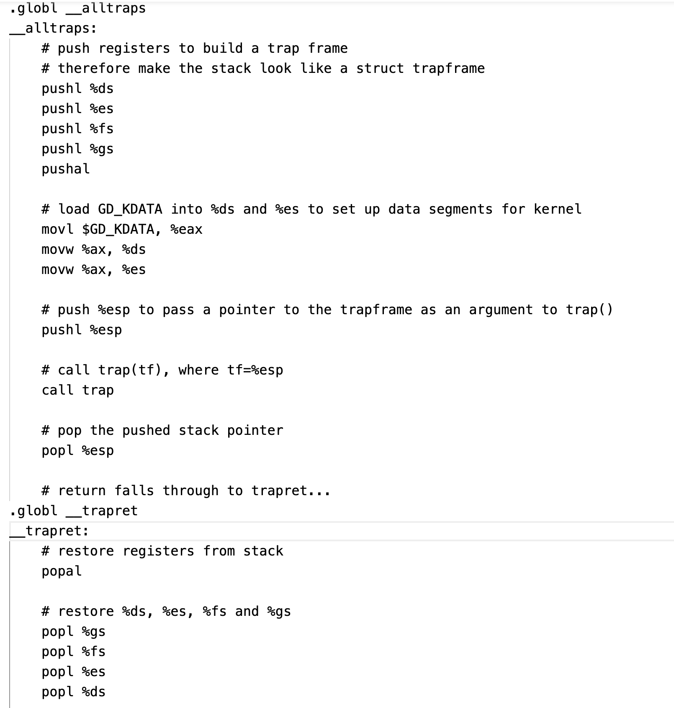
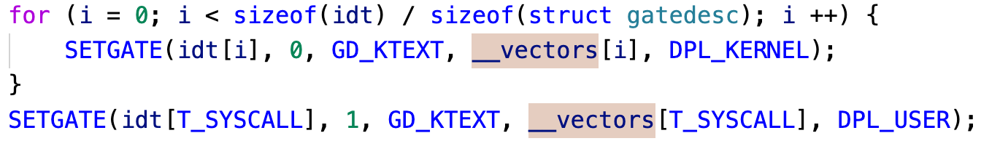

## dt.c

主要功能：GDT和IDT表的建立和加载

1、GDT表在bootsector.S中就建立了，但那处于16位实模式下，而此时程序已进入32位保护模式，GDT每个段描述符限长变成4GB，所以需要建立一个新的GDT表，并加载到GDTR寄存器中。

2、IDT表和GDT表不同的是需要设置中断号和中断向量，并将硬件PIC上的中断号和中断向量绑定，当发生一个硬件中断时，比如按下键盘，PIC就会向系统送一个中断号（硬件完成），然后就会去IDT表中找该中断号对应的中断向量，然后执行相应的中断服务处理程序。

## dt.h

gdt和idt的属性设置

大概说下我理解的gdt和idt吧，详情可见intel手册或者博客。

gdt一般分为3个部分，一个部分为内核使用的段，KERNEL_CS也就是kernel code segment（内核代码段），KERNEL_DS也就是kernel data segment（内核数据段），一个部分是用户使用的段，USER_CS也就是user code segment（用户代码段），USER_DS是user data segment（用户数据段），最后一部分为TSS段，为什么要分为这3部分呢，就我的理解，内核段和用户段主要是为了区分内核代码和用户代码，从而保护内核数据，现代的TSS段一般没多大作用，因为以前的TSS段可以起到分割进程的作用，比如每个任务占有多少MB，多少个任务就有多少个TSS，但现在由于使用虚拟地址，每个任务都看似独占4G空间，以前由TSS界定进程地址空间，现在由进程自己的页表指定，而现在TSS的作用一般是用户代码切换到内核代码时，会自动切换到TSS设置的内核栈。

Idt主要是通过中断门实现的，如果大概理解下是这样的，这个中断门是我们人为设置的，同时还需绑定中断向量，当输入int 0x20时，表示我们访问0x20号的中断门，首先产生一个中断，硬件自动压栈，此后CS和SS会变为内核段代码，esp为我们设置的内核栈，eip为我们设置的中断向量，这均由硬件自动完成。如下图所示。

由于已经绑定好中断向量，接着就会执行对应的中断向量，如下图所示。

其实中断向量就是一个地址，然后会调用相应地址的程序，如下所示。

接着就会保存当前的段寄存器，然后ds和es段寄存器切换到内核的数据段，当执行完中断程序就会切回原来特权级下的代码和数据。

再说下为什么设置一个trapret吧，是这样的，当我们需要一个用户进程的时候，怎么实现从KERNEL_CS段到USER_CS段的跨越呢，中断是一个很好的方法，我们在中断栈中保存用户段的状态，并设置进程的EIP为__trapret，那么这就模拟了一个中断处理程序完成后返回的操作，把中断栈的数据放出来后，自然就变成USER_CS段了，这就实现了用户进程的初始化，即CS为USER_CS。

另外需要注意的是系统调用门需要设置DPL为user，这样用户就可以进行系统调用了，默认中断向量号为0x80.如下图。

关于intel中断详情可见

https://blog.csdn.net/huang987246510/article/details/88954782?utm_medium=distribute.pc_relevant.none-task-blog-baidujs_title-7&spm=1001.2101.3001.4242