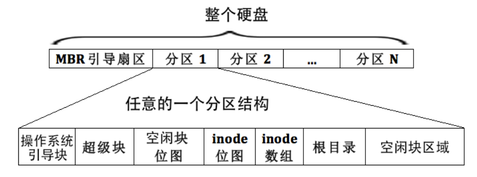
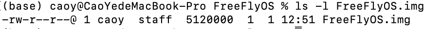
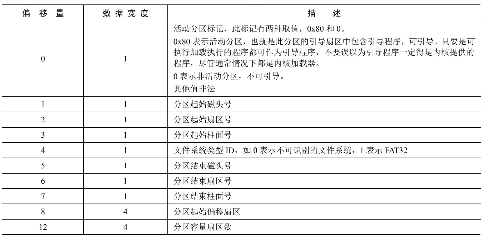
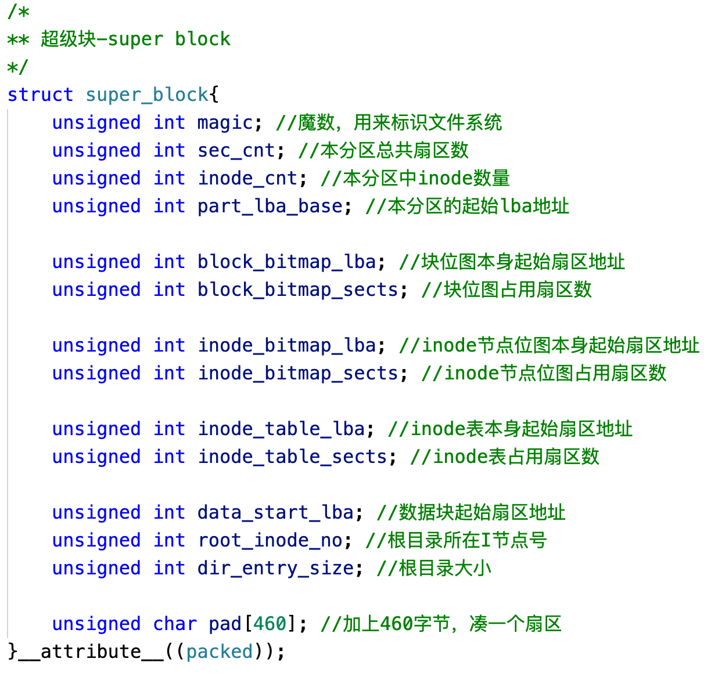
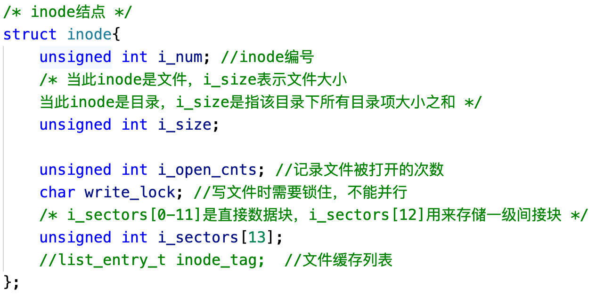
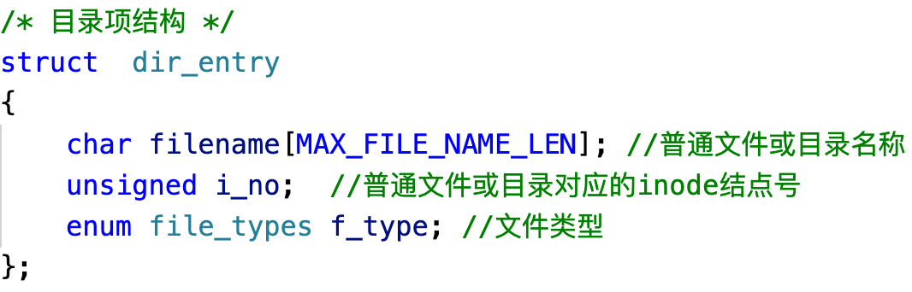
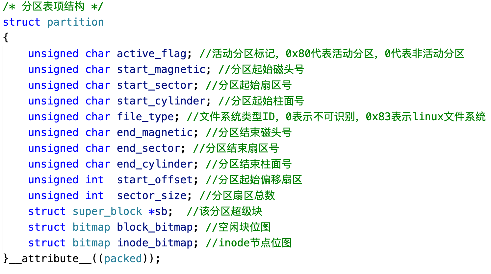
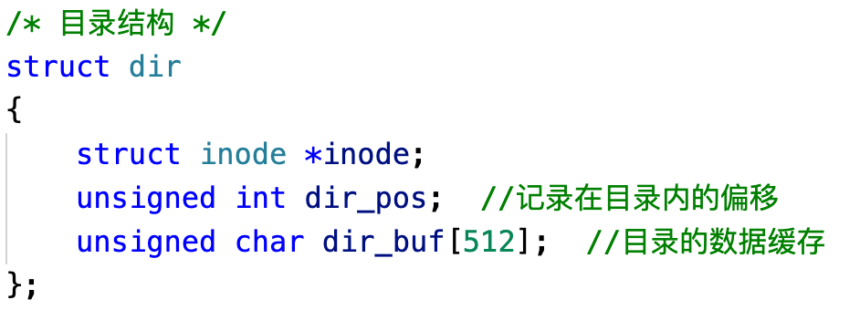
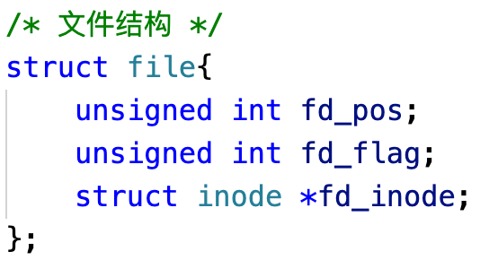

#### 背景知识

整个目录包含了FreeFlyOS的文件系统实现，那么现在从上层到底层来分别介绍下这个文件系统吧！

呃，在此之前，先说明了这个文件系统的来源，主要借鉴了《操作系统真相还原》书中的ext2文件系统的实现，先大概看下其结构吧。

大概就长上面这样，先看下我们这个OS所在硬盘的大小，如下图可以看到为5120000B（即10000个扇区）。

然后说下这个硬盘的分区结构，呃，怎么说呢，在最初没有OS代码的时候，在Ubuntu环境下通过fdisk命令给这个虚拟硬盘进行了分区，只设置了一个主分区，就是从2048号-9999号扇区，有人可能会问为什么不从0号扇区开始呢？反正fdisk命令最低扇区号必须为2048，感兴趣的读者可以继续研究。

FreeFlyOS的硬盘分布如下所示:

0号扇区.                            =》bootblock(MBR)

1号扇区-473号扇区.         =》kernel

500号扇区-530号扇区      =》test_exec

530号扇区-570号扇区      =》test_cat

570号扇区-600号扇区      =》test_pipe

......

2048号扇区-9999号扇区  =》主分区

#### 主分区初始化

我们这里的主分区就是一个文件系统，和ext2文件系统类似，构造相同的结构。接下来一步一步地分析。

一个分区表项如下图所示，在使用fdisk创建主分区的时候，这些数据会自动存储在引导扇区（0号扇区）的0x1BE-0x1FD地址中，所以之前在写MBR的时候我们需要预留一定的空间给主分区表。

知道主分区的信息后，我们可以确定起始磁头号和结束磁头号，接着就可以布局我们的文件系统了。

操作系统引导块我们可以直接跳过，一般用于多系统启动，直接看超级块，也就是2048号扇区，其数据结构如下所示。

由于我们人为设定了主分区最大文件数为1000，每个文件对应一个inode节点，所以可以计算出inode节点位图占用几个扇区，此外ino de节点如下图所示。

那么inode节点大小确定了，就可以确定inode数组所占扇区，接着我们就可以计算剩余的空间能留下多少个空闲块位图和空闲块了，第0号空闲块为根目录所在区域，这样就确定了超级块的内容，直接写到2048号扇区中保存。

接着我们需要确定根目录了，首先给空闲块位图起始扇区中的第0位置1，表示该块已占用，由于根目录对应一个inode节点，接着把inode位图的第0位置1，表示该inode节点已被使用，其对应的实体也就是inode节点数组的第0项进行根目录设置，最后对空闲块起始扇区的根目录项进行设置，如下图所示，这样根目录就完成了。

为了使用方便，我们在文件系统初始化的时候，把下图的信息先读到内存中。

同样，把下图所示的根目录结构先读到内存中，具体步骤是先从主分区表项中获取超级块的根目录所在i节点号，然后将i节点数组中对应的节点读到根目录中。

最后初始化文件表结构，如下图，全部清0。到此为止，分区信息已经初始化完毕。

#### 打开文件

FreeFlyOS中打开文件函数为：int sys_open(const char* pathname, unsigned char flags)，和我们平时用的open有点类似。

首先输入要创建的文件路径，然后我们会对这个路径进行一个简单的解析，比如/a/b/c，

过程如下：

1、先算出这个文件路径的目录深度，该例为3(a、b、c共3层)。

2、然后在所给的目录中查找有无相同名字的文件，首先解析出a目录是否在根目录/下，读出根目录i节点对应的数据块信息，其中包含了根目录下的所有目录项，然后依次比对目录名称，若找到，则返回对应的目录项信息，读取目录项对应的i节点信息，然后返回目录信息，继续往下查找，当找到最后一层文件时，返回该文件的i节点号，若没找到则返回-1。

3、如果是在最后一个路径上没找到，则通过flags标志判断是不是要创建文件，若需要创建文件，则继续第4步，若是打开已存在文件，则继续第5步。

4、先分配一个i节点号，然后从全局文件描述符表中获取一个空闲位的下标，然后将文件表空闲位对应的文件指向新分配的i节点，然后将该文件目录项安装在父目录的下面，然后将父目录i节点数据同步到硬盘，接着将新创建文件的i节点同步到硬盘，同样将inode位图的信息更新到硬盘中，最后将全局文件描述符表对应信息安装到当前进程自己的文件描述符表中。

5、打开相应i节点号对应的inode节点信息，并安装到全局文件描述符表中，然后还需要判断下如果flags标志包含写文件，则需要判断有没有其他进程正在写该文件，最后将对应的文件信息安装到当前进程自己的文件描述符表中。

总结，打开文件最后返回的是当前进程文件描述符表的下标，通过该下标可以找到全局文件描述符表的下标，从而找到对应的文件描述符，包含文件偏移量，文件标志以及文件i节点信息。

#### 关闭文件

FreeFlyOS中关闭文件函数为：int sys_close(int fd)。

简单来讲，就是释放文件描述符对应信息的内存等。

#### 写文件

FreeFlyOS中写文件函数为：int sys_write(int fd, const void* buf, unsigned int count)。

1、首先我们知道当前进程下的文件描述符，然后通过它获取全局文件描述符，从而获得对应的i节点。

2、首先判断文件是否第一次写，如果是，先分配一个空闲块，然后同步下空闲块位图信息，然后分为3种情况，将数据写到i节点对应的数据块中，一种是12个直接数据块够用；一种是数据需要写到一级间接块表中，此时新创建一级间接块表；最后一种是之前的数据已经包含了一级间接块表，此时新建间接块表项即可。

3、同步到硬盘中。

#### 读文件

FreeFlyOS中读文件函数为：int sys_read(int fd, void* buf, unsigned int count)

1、首先我们知道当前进程下的文件描述符，然后通过它获取全局文件描述符，从而获得对应的i节点。

2、和写文件一样，读取i节点对应的全部数据块，将其读入到buf中。

#### 删除文件

FreeFlyOS中删除文件函数为：int sys_unlink(const char* pathname) 

1、删除父目录的对应目录项。

2、删除文件对应的i节点等信息。

3、同步到硬盘。

#### 创建目录

FreeFlyOS中创建目录函数为： int sys_mkdir(const char* pathname)

1、将自己的目录项装在父目录的目录项中。

2、在自己的目录项下装载.和..目录项 。

3、数据同步到硬盘中。

#### 删除目录

FreeFlyOS中删除目录函数为：int sys_rmdir(const char* pathname)

判断该目录下的目录项是否为空，若为空，则删除父目录下对应的目录项。

#### 更改当前工作目录

FreeFlyOS中更改当前工作目录函数为：int sys_chdir(const char* path)

在根目录下逐步寻找目录项，一层一层往下递进，若找到对应的目录项，则把其i节点号放在当前进程中。

#### 获取当前工作目录

FreeFlyOS中获取当前路径函数为：char* sys_getcwd(char* buf, unsigned int size)

通过当前进程获取当前目录的i节点信息，然后逐层往上寻找目录项，直到根目录为止，并把其绝对地址写入buf中。

大概就说这么多吧，整个文件系统算是比较简单的一种，直接在内存中进行读取，还没有涉及缓冲区等信息。