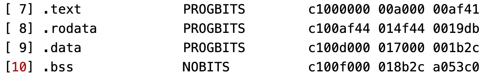

### init.c

该文件是为了内核代码前开启分页，主要解决下面的问题：

在ld文件中，我们必须确定内核代码的VMA(虚拟空间地址)和LMA(物理空间地址)，如果在这之前不开启分页，那么内核代码的虚拟地址和物理地址均是从16MB处开始，若在这之后开启分页，那么整个虚拟地址空间就很难改变了（链接确定虚拟地址），所以会出错。

现在的解决方案时，使用init.c建立一个临时页表，并开启分页，然后把init代码放在1MB处（VMA和LMA均为1MB），而内核代码则放在VMA=0xC1000000处，LMA=0x01000000(16MB)处，因为不开启分页，那么VMA然后init代码执行完毕，跳转到内核代码后，这部分就没用了，所以直接新建一个页表，然后就可以删除这部分代码。

当然还有一种方案，就是qemu模拟器申请4GB内存，然后把VMA和LMA都放在0xC1000000处，在建立页表后，就把内核移到0x01000000处，这种方法笔者也试过，但是当用模拟器申请4G内存时，3.5G以上是不可用的，所以这种方案在使用模拟器时不可取，当使用真机时可能有效，读者们可以自行尝试。

init部分主要功能就是建立临时页表，主要包括内核代码部分和内核栈部分的映射，从下图的elf文件解析中我们可以看出需要3个页目录项，也就是12MB，才能包含bss段。

然后映射下内核栈，接着就把页目录表地址读入cr3寄存器，需要注意的是，cr3寄存器存储的都是物理地址，但由于init部分在链接脚本中没有指定虚拟地址，所以其虚拟地址=物理地址，接着开启cr0寄存器的PG位，从而打开分页模式，然后将esp指针指向内核栈的栈顶，最后跳转到内核的main函数，自此，init部分结束。