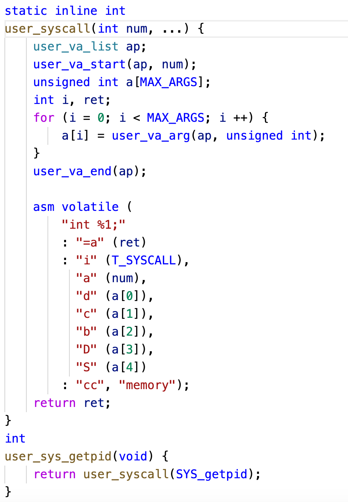
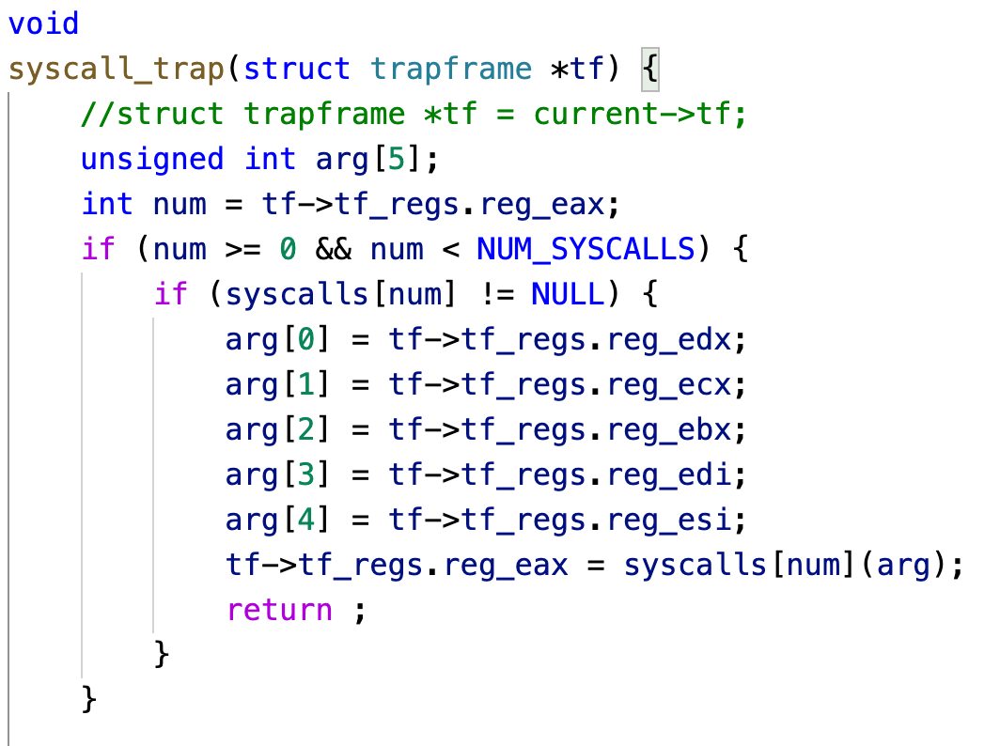
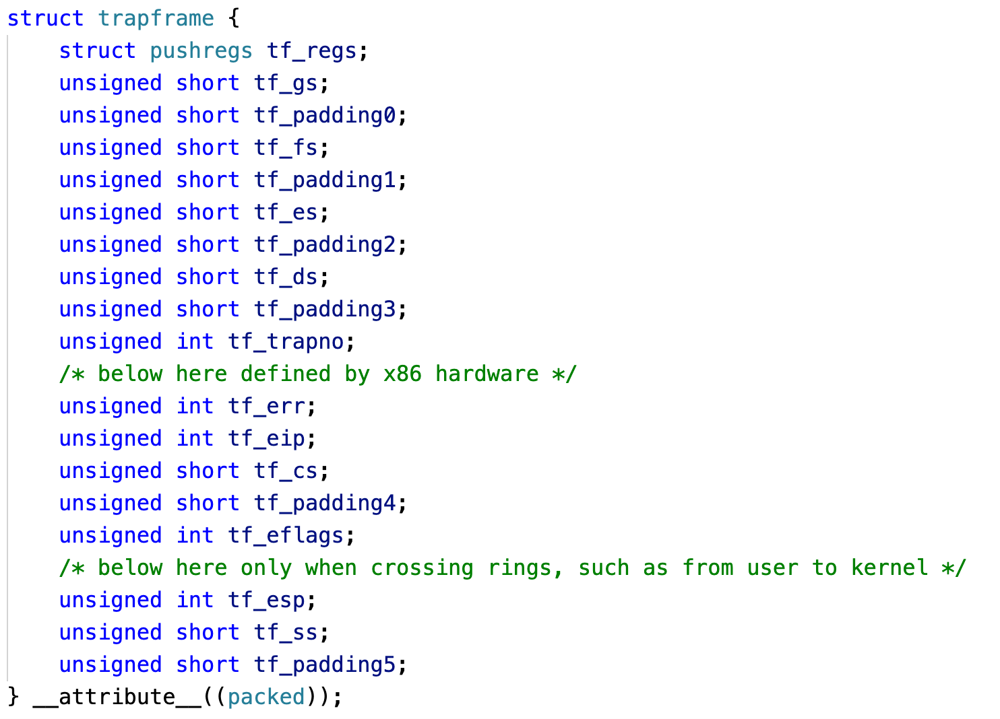
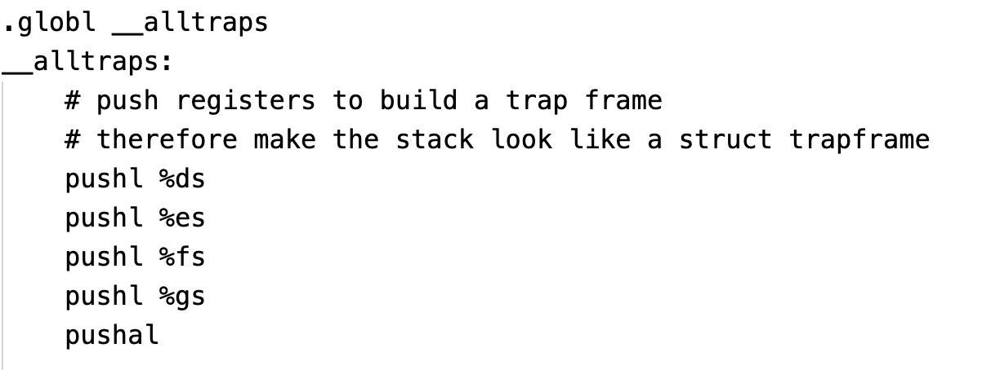

## trap.c

中断服务程序IRQ的实现，目前只实现了时钟、串口和键盘中断。

## trap.h

trap号，硬件IRQ号，两者主要区别是陷阱门发生后不会关中断，可能会出现中断嵌套，而中断门发生后会关闭中断，防止出现中断嵌套。

## trapentry.S

用于保存中断处理程序前的现场（上下文），当程序执行完毕后返回原来的现场，各种段寄存器恢复成原值。

## vector.S

中断向量表，在IDT初始化时和中断号绑定，初始化了256个中断向量，实际只用了几个。

关于中断，网上有很多详细的资料，背景类知识就不再赘述，大概说一下FreeFlyOS的中断体系把，主要包含两种，一种是硬件中断，比如缺页异常、时钟中断、键盘中断、串口中断、硬盘中断等等，这些中断处理程序设计的比较简单。还有一种是软中断，我们通过中断门实现的一种中断，主要用于系统调用，也就是ring3权限的用户想要对系统资源进行访问时,ring0权限的OS提供给用户访问的一种接口。大概讲一下系统调用怎么传递参数吧，首先我们看用户视角下的系统调用。

一般而言，系统调用的中断号是0x80，这个大家应该都知道，那么参数应该如何传递呢，这里我们规定最多只能传递5个参数，而且每个参数需要放在指定的寄存器中，首先把参数数量放在eax中，然后第一个参数放在edx参数，依次类推。

同样，内核中的中断服务程序会根据栈帧接受到这些信息，从而完成参数的传递。

现在还需说明一个问题，我们使用中断的时候，硬件会自动压栈，只包含SS、ESP、EFLAGS、CS、EIP、ERROR等信息，而这些寄存器信息并不包含在内，所以我们需要构建一个参数传递栈帧，如下图所示。

硬件压栈的部分我们就不需要继续压栈了，只需要对栈帧其他寄存器进行压栈即可，构造过程如下，注意pushal是压入所有通用寄存器。

就说这么多吧，拜拜。