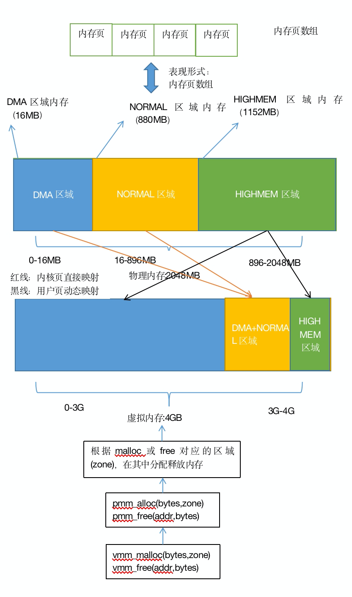

#### memlayout.h

内存布局信息

#### pmm.c

物理内存管理

呃，关于内存管理这块，说实话感觉自己写的很烂，烂归烂，分配和释放内存还是没问题的，只是有些情况没有考虑全面，比如内存用完之后，分配算法就会失效，不多说了，先来看下怎么实现的吧，如下图所示，代码很简单，就是页表映射稍微复杂点，另外注明一下，cr3为页表基址，这个地址必须为页表的物理地址，然后页表项和页项分别存的是页表的物理地址和页的物理地址，所以需要进行一个线性变换（若内核页使用直接映射方式）。

