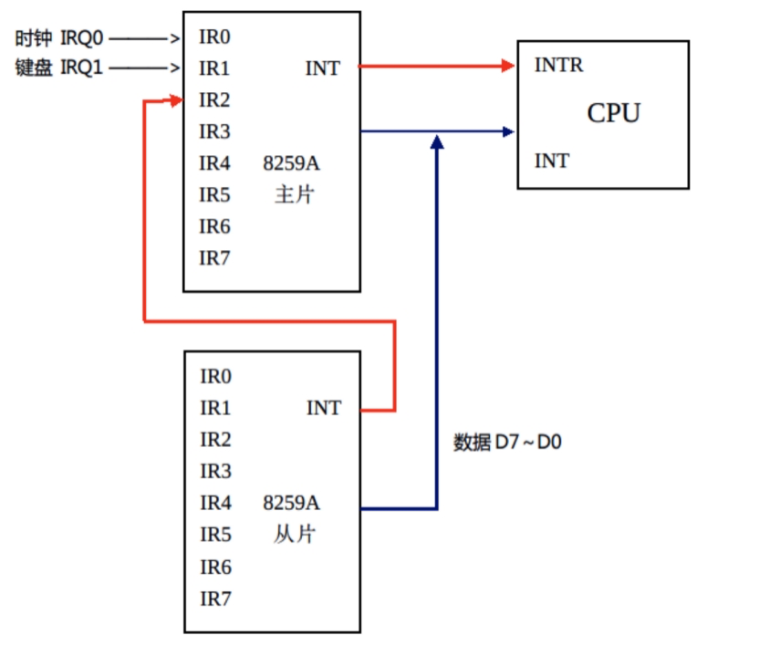

## pic.c

8259A芯片级联控制器PIC的初始化

#### 8259A芯片

8259A是[专门](https://baike.baidu.com/item/专门/8698309)为了对8085A和8086/8088进行中断[控制](https://baike.baidu.com/item/控制/17222)而设计的芯片，它是可以用程序控制的中断控制器。单个的8259A能管理8级向量优先级中断。在不增加其他电路的情况下，最多可以级联成64级的向量优级[中断系统](https://baike.baidu.com/item/中断系统/10480702)。8259A有多种工作方式，能用于各种系统。各种工作方式的设定是在初始化时通过软件进行的。 在[总线控制器](https://baike.baidu.com/item/总线控制器/8829516)的控制下，8259A芯片可以处于编程状态和操作状态，编程状态是CPU使用IN或OUT指令对8259A芯片进行初始化编程的状态。

一个外部[中断请求](https://baike.baidu.com/item/中断请求)信号通过中断请求线[IRQ](https://baike.baidu.com/item/IRQ/1229055)，传输到IMR（[中断屏蔽](https://baike.baidu.com/item/中断屏蔽)[寄存器](https://baike.baidu.com/item/寄存器)），IMR根据所设定的[中断屏蔽字](https://baike.baidu.com/item/中断屏蔽字)（OCW1），决定是将其丢弃还是接受。如果可以接受，则8259A将IRR（中断请求暂存寄存器）中代表此IRQ的位置置1，以表示此IRQ有中断请求信号，并同时向CPU的INTR（中断请求）管脚发送一个信号。但CPU这时可能正在执行一条指令，因此CPU不会立即响应。而当这CPU正忙着执行某条指令时，还有可能有其余的IRQ线送来中断请求，这些请求都会接受IMR的挑选。如果没有被屏蔽，那么这些请求也会被放到IRR中，也即IRR中代表它们的IRQ的相应位会被置1。

当CPU执行完一条指令时后，会检查一下INTR管脚是否有信号。如果发现有信号，就会转到中断服务，此时，CPU会立即向8259A芯片的INTA（中断应答）管脚发送一个信号。当芯片收到此信号后，判优部件开始工作，它在IRR中，挑选优先级最高的中断，将[中断请求](https://baike.baidu.com/item/中断请求)送到ISR（中断服务[寄存器](https://baike.baidu.com/item/寄存器)），也即将ISR中代表此[IRQ](https://baike.baidu.com/item/IRQ/1229055)的位置一，并将IRR中相应位置零，表明此中断正在接受CPU的处理。同时，将它的编号写入[中断向量](https://baike.baidu.com/item/中断向量)寄存器[IVR](https://baike.baidu.com/item/IVR/279431)的低三位（IVR正是由ICW2所指定的，不知你是否还记得ICW2的最低三位在指定时都是0，而在这里，它们被利用了！）这时，CPU还会送来第二个INTA信号，当收到此信号后，芯片将IVR中的内容，也就是此中断的[中断号](https://baike.baidu.com/item/中断号)送上通向CPU的数据线。

这个内容看起来仿佛十分复杂，但如果我们用一个很简单的比喻来解释就好理解了。CPU就相当于一个公司的老总，而8259A芯片就相当于这个老总的秘书。比如有很多人想见老总，但老总正在打电话，于是交由秘书先行接待。每个想见老总的人都需要把自己的名片交给秘书，秘书首先看看名片，有没有老总明确表示不愿见到的人，如果没有就把它放到一个盒子里面。这时老总的电话还没打完，但不停的有人递上名片求见老总，秘书就把符合要求的名片全放在盒子里了。老总打完电话了，探出头来问秘书：有人想见我吗？这时，秘书就从盒子里挑选一个级别最高的，并把他的名片交给老总。

初始化流程：

1、根据ICW1的格式，当发送的字节第5比特位（D4）=1，并且地址线A0=0时，表示对ICW1编程。一般把ICW1设置为0x11，表示中断请求是边沿触发、多片8259A级联并且需要发送ICW4。

2、在设置了ICW1后，当A0=1时表示对ICW2进行设置，此时8259A主芯片的端口地址是0x21，从芯片的端口地址是0xA1。在Linux-0.11系统中，主片的ICW2设置为0x20，表示主片中断请求0-7级对应的中断号是0x20-0x27，从片的ICW设置为0x28，表示从片中断请求从中断号0x28开始。

3、对于ICW3来说，把8259A主片的ICW3设置为0x04，表示IR2连接了从片，8259A从片设置为0x02，表示该片连接到主片的IR2引脚。

4、8259A主片和从片的ICW4命令字均设置为0x01，表示8259A 芯片被设置成普通全嵌套、非缓冲、非自动结束中断方式，并且用于8086及其兼容系统。

5、允许8259A主片和从片的中断。