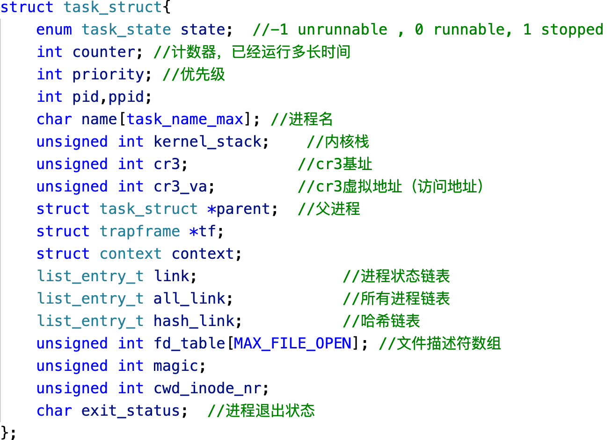
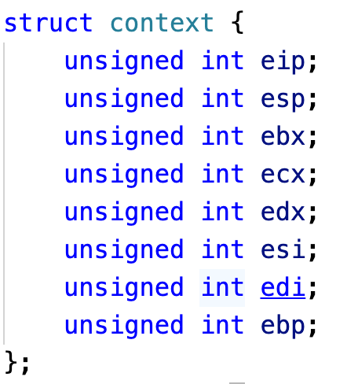
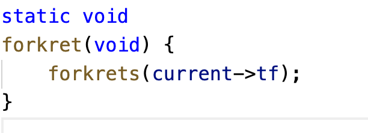
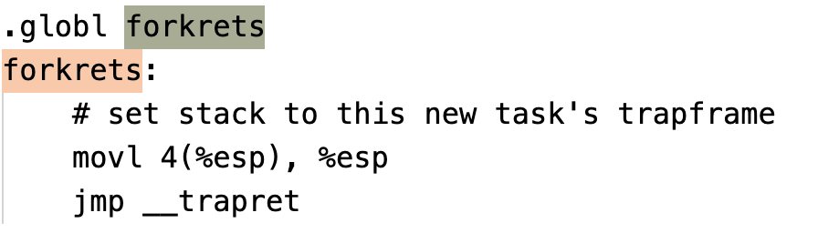

关于进程这一块，还是比较复杂的。

首先看下FreeFlyOS的进程描述符，如下图所示。

1、首先我们会创建一个内核进程，这些信息均已写好，该进程主要任务是怠速，也就是当其他进程无法运行时，该任务就会占用CPU。

2、接着手动创建一个用户进程，主要步骤如下，先构造好用户进程的信息，主要是用户进程的内核栈和用户本身使用的栈，一般在创建任务时，会分配2页给进程使用，前一页页尾作为用户自己使用的栈，后一页页尾作为用户内核栈。所以我们只需要在用户内核栈中构造好用户进程信息（USER_CS、USER_DS等），然后切换到用户内核栈，调用__trapret函数，模拟中断返回的后续操作，则该函数会将用户进程信息弹出，故当前状态变为USER_CS，即用户权限下的环境。

3、用户进程会直接调用user目录下的shell，从而实现用户和系统的交互操作。

4、一般情况下，时钟中断会进行进程切换，但由于增加了shell，所以当一个进程等待时，也会进行进程切换。进程切换时需要注意的是，更换内核栈和页表，内核栈是用户在进行系统调用时，内核权限下访问资源的栈，然后进行上下文切换，一般的上下文由以下寄存器组成。如果是线程切换，由于共用一套内核栈和页表，所以只需要进行上下文切换即可。

5、简单说下FreeFlyOS中fork的原理，假定有一个用户进程调用了fork代码，首先我们会创建一个子进程信息，关键在于构造子进程的用户栈信息和内核栈信息，首先子进程的用户栈需要拷贝父进程的用户栈，保存之前父进程的函数调用关系，不然等待子进程执行时，函数就会跑飞，但是需要改下栈中和进程地址有关的信息，也就是要构造两套地址不同、功能相同的栈，不然还是用了同样的栈。接着中断栈直接拷贝父进程的中断栈帧，但是需要改下esp的地址，让它指向用户进程栈，同时上下文中设置esp为当前中断栈地址，eip为forkre函数（调用__trapret）。当子进程数据构造完毕时，当时钟中断开始进程调度时，子进程会按照它的上下文信息执行，记住此时栈指向了中断栈帧的启示地址，首先调用forkret,然后forkret调用forkrets,接着把esp设置为中断栈帧的esp（用户栈），要记住内核权限转化为用户权限是软件模拟的过程，没有硬件自动切换栈的操作，这样子进程就会变成和父进程一样的用户进程，并且获取了之前的函数调用信息，开始下一步的操作。

大概就讲这么多了，写文档的过程太枯燥了，去打游戏了，88！若有疑问可以联系295957410@qq.com