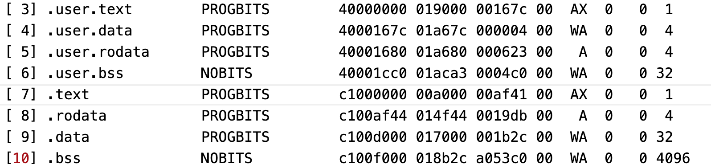

关于用户目录，首先要说的是这部分代码和内核代码是分开存储的，从elf文件头信息中可以看到区别。

这部分用户代码和内核代码一样都是需要常驻内存的，其主要区别是地址空间不同还有内存页权限不同，那么说一下用户代码主要做了些啥吧。

1、提供了系统调用的接口。

2、实现了用户命令，包括内部命令和外部命令，简单讲下他们的区别吧，外部命令是说该命令是存储在文件系统的外部程序，执行该命令实际上是从文件系统上加载该程序到内存后运行的过程，也就是说外部命令会以进程的方式执行，比如ls命令，它通常的存储路径是/bin/ls。内部命令也叫内建命令，是系统本身提供的功能，它们并不以单独的程序文件存在，只是提供一些单独的功能函数。在FreeFlyOS中，为了简单，将ls、cd等命令均弄成了内部命令，外部命令主要有cat、pipe、prog等，以文件形式存在于根目录下。

3、提供了用户系统交互的shell。

大概就这么多吧，这些命令的实现还是比较简单的，搞清楚每个系统调用干了啥基本就OK了。

