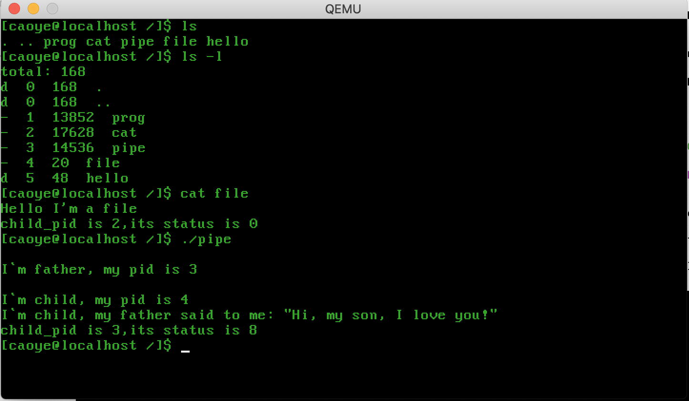
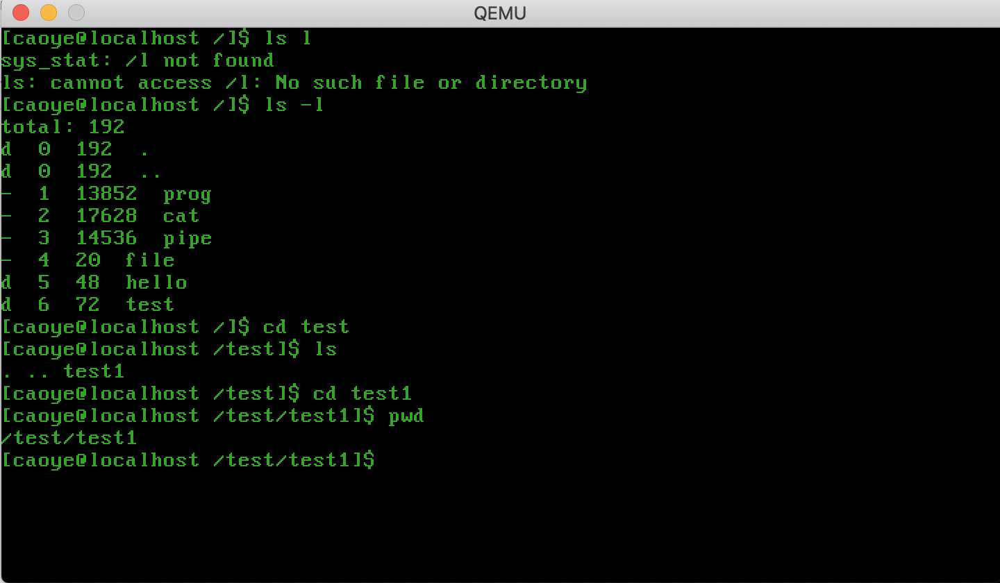
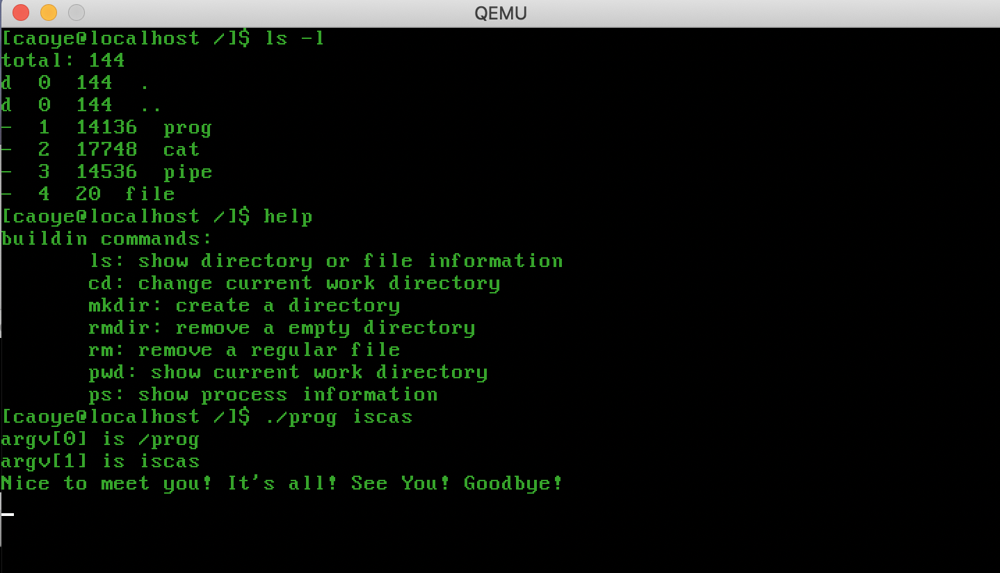
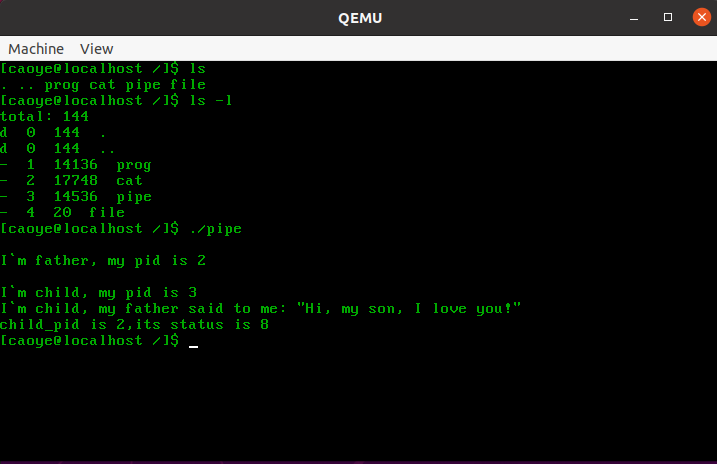
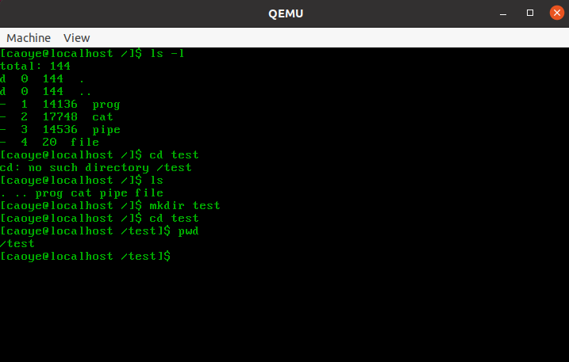
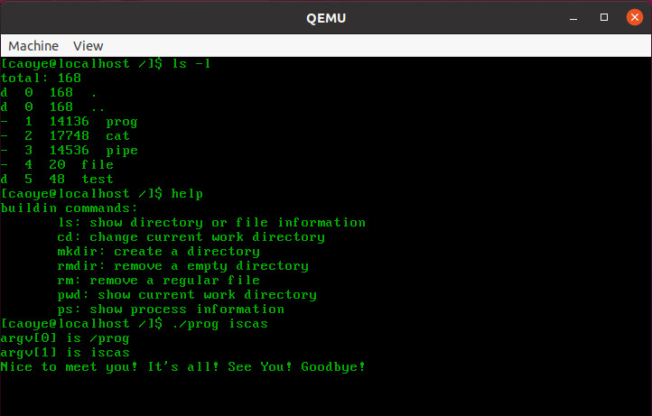

## FreeFlyOS

A simple OS for learing! Here we go! Ale, ale, ale!Go, go, go! Ale, ale, ale!Let's do it together!

You can do memory management、multi-progress、file system and so on.

## Environment

Why choose x86_64-elf-toolchain? 

Because FreeFlyOS compiled and linked by this toolchain has nothing to do with the system. In fact, you can also use gcc under linux to compile the operating system, but there will be more system-related program sections, resulting in MBR exceeding 512B, so use x86_64-elf-toolchain to Minimize the OS.

I only test in my Mac OS(x86-64) and Ubuntu(x86-64).It takes a long time to set up the environment, please be patient.

#### Mac OS 

you need to do :

1、install curl and git

2、install brew，you can see how to install it in https://brew.sh，the command is:

```bash
/bin/bash -c "$(curl -fsSL https://raw.githubusercontent.com/Homebrew/install/master/install.sh)" 
```

3、install x86_64-elf-binutils

```
brew install x86_64-elf-binutils
```

4、install x86_64-elf-gcc 

```
brew install x86_64-elf-gcc 
```

5、install cmake 

```
brew install cmake
```

6、install qemu 

```
brew install qemu
```

#### Linux(Ubuntu-20.04.1-amd64)

you need to do:

1、install curl and git

```
sudo apt install curl git 
```

2、install brew，you can see how to install it in https://brew.sh，the command is:

```bash
/bin/bash -c "$(curl -fsSL https://raw.githubusercontent.com/Homebrew/install/master/install.sh)" 
```

3、install x86_64-elf-binutils

```
brew install x86_64-elf-binutils
```

4、install x86_64-elf-gcc 

```
brew install x86_64-elf-gcc 
```

5、install cmake 

```
brew install cmake
sudo ln -s (cmake安装目录)/bin/cmake /usr/bin/cmake   //cmake一般没有直接装在/usr/bin下
```

6、install qemu 

```
sudo apt install qemu-sysetm-i386
```

## Run

```
sh run.sh
```

In Mac OS，the result is:







In Linux,the result is:







